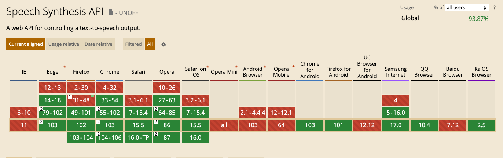

## 实时播报后台推送的消息

> 需求：某个产品（网页版）包含比较紧急的消息通知，用户需要在有重要通知来了通过语言播报的形式播放出来。

\(^o^)/

### 技术方案

H5 提供了原生方法支持，网页语音 API 的 [SpeechSynthesis](https://developer.mozilla.org/zh-CN/docs/Web/API/SpeechSynthesis) 接口是语音服务的控制接口；它可以用于获取设备上关于可用的合成声音的信息，开始、暂停语音，或除此之外的其他命令。
浏览器支持度不是很好，好在 Chrome for Android 支持了，因为的用户大多是在 Android 平板上使用。

### 准备工作

* 安装 java 环境
* 安装 [activeMQ](https://activemq.apache.org/getting-started#InstallationProcedureforUnix) 作为服务器端 socket server，主要是用来给客户端发送 socket 消息。

### 开始

* 安装好后启动 activeMQ，`activemq start`, 然后打开浏览器输入：`http://127.0.0.1:8161/admin/` 进入管理员页面，账号密码都是 `admin`。
* 我们这里采用 [stompjs](https://github.com/stomp-js/stompjs) 来连接 socket，对应的 ws 地址为：`ws://127.0.0.1:61614/stomp`

